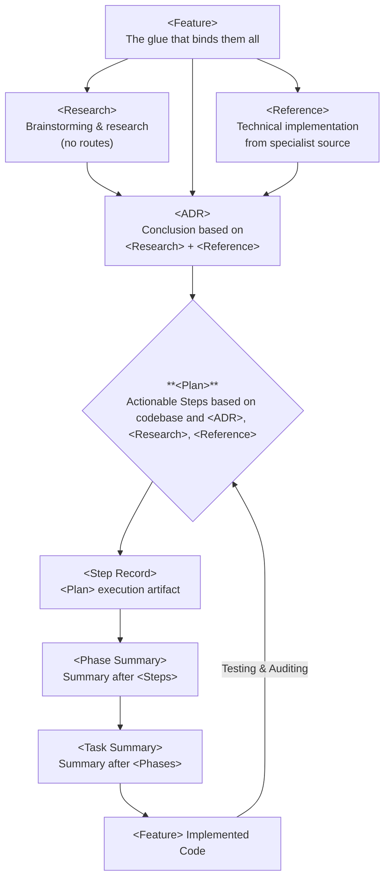
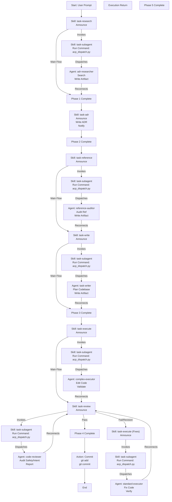

# Research, Design, Task Driven Development

This folder contains the rule and template collection mandating the research, reference, ADR, and sub-agent based developmment process.
The rules are compatible with Google Antigravity, Gemini CLI and Claude Code.

## User Manual

### 1. The Workflow

The system enforces a strict **Research → Decide → Plan → Execute** cycle. You do not simply "write code"; you build a trail of documentation that ensures quality and context preservation.

**High-Level Summary:**
*   **Research (`task-research`)** & **Reference (`task-reference`)** gather the data.
*   **ADR (`task-adr`)** formalizes the choice.
*   **Plan (`task-write`)** defines the steps.
*   **Execute (`task-execute`)** builds it.
*   **Review (`task-review`)** validates it.
*   **Curate (`docs-curator`)** cleans up.

#### Detailed Steps

1.  **Research (`task-research`)**:
    *   **Goal:** Understand the problem, explore libraries, and find "frontier" patterns.
    *   **Agent:** `adr-researcher` (High Tier).
    *   **Output:** `.docs/research/...` artifact.
    *   *Usage:* "Activate `task-research` to investigate [topic]."

2.  **Architect (`task-adr`)**:
    *   **Goal:** Make binding technical decisions based on your research.
    *   **Output:** `.docs/adr/...` artifact.
    *   *Usage:* "Activate `task-adr` to formalize our decision on [topic]."

3.  **Plan (`task-write`)**:
    *   **Goal:** Convert the ADR into a step-by-step implementation plan.
    *   **Agent:** `task-writer` (High Tier).
    *   **Output:** `.docs/plan/...` artifact.
    *   *Usage:* "Activate `task-write` to create a plan for [feature]."

4.  **Execute (`task-execute`)**:
    *   **Goal:** Implement the plan using specialized sub-agents.
    *   **Agent:** Orchestrator (You) + Executors (`simple-executor`, `complex-executor`).
    *   **Output:** Code changes + `.docs/exec/...` logs.
    *   *Usage:* "Activate `task-execute` to implement the plan."

5.  **Curate (`docs-curator`)**:
    *   **Goal:** Maintain the hygiene of the `.docs/` vault.
    *   **Agent:** `docs-curator` (Medium Tier).
    *   *Usage:* "Run the `docs-curator` agent to audit the vault."

### 2. Agent Reference

| Agent | Tier | Role | When to use |
| :--- | :--- | :--- | :--- |
| **`adr-researcher`** | HIGH | Lead Researcher | When exploring new technologies, libraries, or complex architectural problems. |
| **`task-writer`** | HIGH | Planner | After an ADR is approved. Converts decisions into actionable steps. |
| **`docs-curator`** | MEDIUM | Librarian & Orchestrator | To fix broken links, bad tags, and strictly enforce documentation schema rules. |
| **`reference-auditor`** | MEDIUM | Code Auditor | To scan the codebase or reference implementations (e.g., Zed) for patterns to copy. |
| **`complex-executor`** | HIGH | Senior Engineer | For difficult logic, refactors, or "blank slate" implementations requiring deep reasoning. |
| **`standard-executor`** | MEDIUM | Engineer | For typical feature work, component implementation, and standard logic. |
| **`simple-executor`** | LOW | Junior Engineer | For rote tasks, text updates, simple fixes, and menial labor dispatched by other agents. |
| **`code-reviewer`** | HIGH | Reviewer & Safety Officer | To audit code for safety, intent compliance, and quality. Replaces the legacy safety-auditor. |

## Overview Diagram

> **Note:** The `task-subagent` skill is a **utility task** used internally by other agents. It should **not** be called directly by the user.

## Markdown Files

Workflows, agents, skills, and templates are defined in their respective subfolders without any tool specific yaml configuration headers or metadata.
Tools reference relatively the `.rules` folder. and define their tool specific yaml configuration headers.

## Example Workflow

A possible workflow might look something like this disregarding loopbacks and descision reversals:

