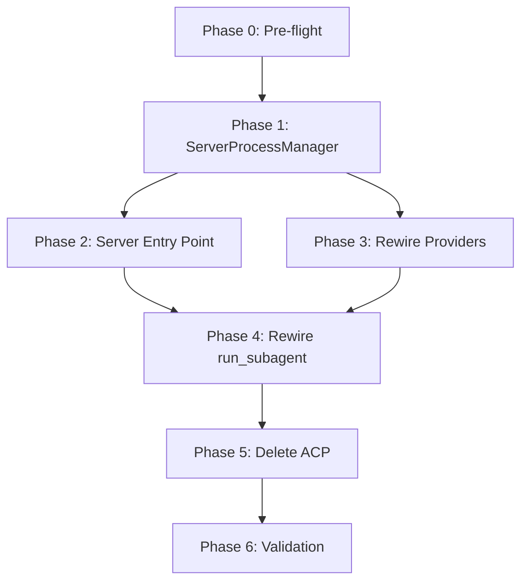

---
tags:
  - '#plan'
  - '#a2a'
date: '2026-02-24'
related:
  - '[[2026-02-24-subagent-protocol-adr]]'
  - '[[2026-02-24-subagent-protocol-server-architecture-adr]]'
  - '[[2026-02-24-subagent-protocol-server-manager-adr]]'
  - '[[2026-02-24-subagent-protocol-research]]'
  - '[[2026-02-24-cli-protocols-research]]'
---

<!-- DO NOT add 'Related:', 'tags:', 'date:', or other frontmatter fields
     outside the YAML frontmatter above -->

# `subagent-protocol` `full-rewrite` plan

Full rewrite of the protocol layer to replace ACP bridges with a unified
A2A protocol stack. Implements the decisions in
`[[2026-02-24-a2a-adr]]`,
`[[2026-02-24-a2a-server-architecture-adr]]`, and
`[[2026-02-24-a2a-server-manager-adr]]`.

## Proposed Changes

### Delete ~3800 LOC of ACP bridge code

Per `[[2026-02-24-subagent-protocol-adr]]`, the entire `protocol/acp/`
directory is deleted: `claude_bridge.py`, `gemini_bridge.py`, `client.py`,
`types.py`, and all ACP tests. The `agent-client-protocol` pip package
stays installed for Zed editor integration only.

### Build `ServerProcessManager`

Per `[[2026-02-24-subagent-protocol-server-manager-adr]]`, a new
`protocol/a2a/server_manager.py` (~200 LOC) manages the lifecycle of all
A2A server processes. Both `orchestration/subagent.py` and
`orchestration/team.py` use the same instance. API: `spawn()`,
`wait_ready()`, `shutdown()`, `shutdown_all()`, `list_active()`.

### One server per agent

Per `[[2026-02-24-subagent-protocol-server-architecture-adr]]`, each agent
gets its own ephemeral HTTP server process. No master server. Orchestrator
is the A2A client.

### Rewire orchestration

`run_subagent()` in `orchestration/subagent.py` replaces ACP imports
(`spawn_agent_process`, `SubagentClient`, `ClientSideConnection`) with
`ServerProcessManager` + `A2AClient`. `TeamCoordinator` in
`orchestration/team.py` adopts the same `ServerProcessManager`.

### Rewire providers

`GeminiProvider` and `ClaudeProvider` update `prepare_process()` to produce
A2A server `ProcessSpec` instead of ACP bridge `ProcessSpec`. All existing
logic (OAuth, model selection, system prompts) is preserved.

### Current state reference

| Component             | Location                                    | LOC  | Current   |
| --------------------- | ------------------------------------------- | ---- | --------- |
| Subagent orchestrator | `orchestration/subagent.py`                 | 618  | ACP       |
| Team orchestrator     | `orchestration/team.py`                     | 973  | A2A       |
| Claude ACP bridge     | `protocol/acp/claude_bridge.py`             | ~800 | ACP       |
| Gemini ACP bridge     | `protocol/acp/gemini_bridge.py`             | ~383 | ACP       |
| ACP client            | `protocol/acp/client.py`                    | ~500 | ACP       |
| Claude A2A executor   | `protocol/a2a/executors/claude_executor.py` | ~600 | A2A       |
| Gemini A2A executor   | `protocol/a2a/executors/gemini_executor.py` | ~300 | A2A       |
| A2A server            | `protocol/a2a/server.py`                    | ~80  | A2A       |
| Claude provider       | `protocol/providers/claude.py`              | 359  | ACP specs |
| Gemini provider       | `protocol/providers/gemini.py`              | 469  | ACP specs |

## Tasks

<!-- IMPORTANT: This document must be updated between execution runs to
     track progress. -->

- Phase 0 — Pre-flight & Cleanup

  1. Delete `tmp-ref/python-a2a/` if present
  1. Run full existing test suite, capture baseline
  1. Verify `a2a-sdk` is at latest version in `pyproject.toml`

- Phase 1 — `ServerProcessManager` + Executor Hardening

  1. Create `protocol/a2a/server_manager.py` (~200 LOC)
     — `spawn()`, port discovery, `wait_ready()`, stderr drain,
     `shutdown()`, `shutdown_all()`, `list_active()`, orphan prevention

  1. Create `protocol/a2a/tests/test_server_manager.py`
     — spawn + port discovery, readiness probe retry, shutdown cleanup,
     timeout handling, orphan prevention

  1. Create `protocol/a2a/executors/base.py`
     — shared retry, cancel, concurrency lock, heartbeat emission

- Phase 2 — A2A Server Entry Point

  1. Update `protocol/a2a/server.py` to be runnable as
     `python -m vaultspec.protocol.a2a.server --provider gemini --port 0`

  1. Add `protocol/a2a/__main__.py`

  1. Manual: start server, verify agent card at
     `/.well-known/agent-card.json`

- Phase 3 — Rewire Providers

  1. `providers/gemini.py` — update `prepare_process()` to A2A server args
  1. `providers/claude.py` — update `prepare_process()` to A2A server args
  1. `providers/base.py` — add `protocol` field to `ProcessSpec`
  1. Update `protocol/tests/test_providers.py`

- Phase 4 — Rewire `run_subagent()`

  1. Create `protocol/a2a/a2a_client.py` — thin vaultspec A2A client
     wrapping `a2a-sdk` `A2AClient` (`submit_task`, `stream_task`,
     `cancel_task`, `get_task`)

  1. Move `SubagentResult`, `SubagentError` out of `acp/` to
     `protocol/types.py` (keep backward-compat re-exports temporarily)

  1. Rewrite `run_subagent()` — remove all ACP imports, use
     `ServerProcessManager` + `A2AClient`

  1. Update `TeamCoordinator` to use `ServerProcessManager`

  1. Update `orchestration/__init__.py` exports

  1. Write tests — mock `ServerProcessManager`, mock `A2AClient` via
     `respx`, test happy path / timeout / cancel / error

- Phase 5 — Delete ACP Layer

  1. Verify no production imports from `protocol.acp`
  1. Delete `protocol/acp/` entirely
  1. Update `protocol/__init__.py` — remove `from .acp import` lines
  1. Remove ACP-specific test utilities
  1. Clean up `pyproject.toml` if needed

- Phase 6 — Validation & Polish

  1. Run full test suite
  1. Manual: spawn real Gemini A2A subagent
  1. Manual: A2A Inspector test
  1. Manual: run subagent via CLI
  1. Verify team coordination still works
  1. Write walkthrough

## Parallelization

Phases 2 and 3 can run in parallel after Phase 1 completes. Phase 4
requires both 2 and 3. Phase 5 can only start after Phase 4 is wired and
tested.



### Risk register

| Risk                                                                  | Impact | Mitigation                                                             |
| --------------------------------------------------------------------- | ------ | ---------------------------------------------------------------------- |
| `ServerProcessManager` untested critical code                         | HIGH   | Extensive unit tests, integration test with real subprocess            |
| Gemini CLI `--experimental-acp` may not work as executor stdin/stdout | HIGH   | Test with real Gemini CLI in Phase 2 manual step                       |
| `run_subagent()` has 618 LOC interleaved ACP logic                    | MEDIUM | Rewrite, don't incrementally edit; keep old until new passes           |
| `SubagentResult`/`SubagentError` imported from 8+ sites               | MEDIUM | Move types first (4.2), keep backward-compat re-exports                |
| Team coordinator assumes pre-running A2A servers                      | LOW    | Verify team tests pass; update `team.py` to use `ServerProcessManager` |

### Estimated effort

| Phase     | LOC changed    | Time             |
| --------- | -------------- | ---------------- |
| Phase 0   | ~0             | 15 min           |
| Phase 1   | ~300 new       | 2–3 hours        |
| Phase 2   | ~100 new       | 1 hour           |
| Phase 3   | ~200 modified  | 1–2 hours        |
| Phase 4   | ~500 rewritten | 3–4 hours        |
| Phase 5   | ~3800 deleted  | 30 min           |
| Phase 6   | ~0 validation  | 1–2 hours        |
| **Total** |                | **~10–13 hours** |

## Verification

### Automated tests

```pwsh

# Phase 0 baseline

uv run pytest src/vaultspec/protocol/tests/ -v --tb=short 2>&1 |
    Tee-Object -FilePath .vault/logs/baseline-protocol-tests.log
uv run pytest src/vaultspec/protocol/a2a/tests/ -v --tb=short 2>&1 |
    Tee-Object -FilePath .vault/logs/baseline-a2a-tests.log
uv run pytest src/vaultspec/orchestration/tests/ -v --tb=short 2>&1 |
    Tee-Object -FilePath .vault/logs/baseline-orchestration-tests.log

# Phase 1 exit

uv run pytest src/vaultspec/protocol/a2a/tests/test_server_manager.py -v

# Phase 3 exit

uv run pytest src/vaultspec/protocol/tests/test_providers.py -v

# Phase 4 exit

uv run pytest src/vaultspec/orchestration/tests/ -v

# Phase 5 — verify zero ACP remnants

rg "from.*protocol\.acp" src/vaultspec/ --glob="!**/tests/**"
rg "from acp " src/vaultspec/ --glob="!**/tests/**"

# Phase 6 — full suite

uv run pytest src/vaultspec/ -v --tb=short 2>&1 |
    Tee-Object -FilePath .vault/logs/final-test-run.log
```

### Manual verification

- Spawn a real Gemini A2A server, verify agent card, submit a prompt.
- Point the A2A Inspector at the running server, observe events.
- Run a subagent via CLI (`vaultspec agent run`), confirm end-to-end.
- Confirm team coordination still works through A2A with shared
  `ServerProcessManager`.

### Success criteria

Per `[[2026-02-24-subagent-protocol-adr]]`:

- `rg "acp" src/vaultspec/protocol/` returns zero hits outside comments.
- All existing non-ACP tests pass.
- Subagents and teams both use `ServerProcessManager` for lifecycle.
- A2A Inspector works against any running agent server.
