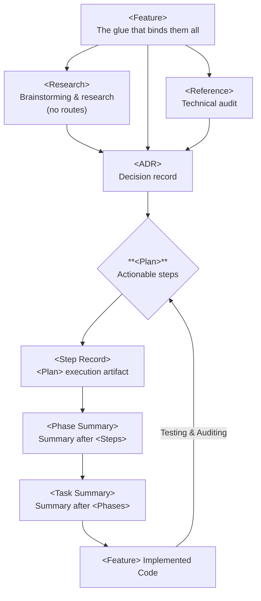
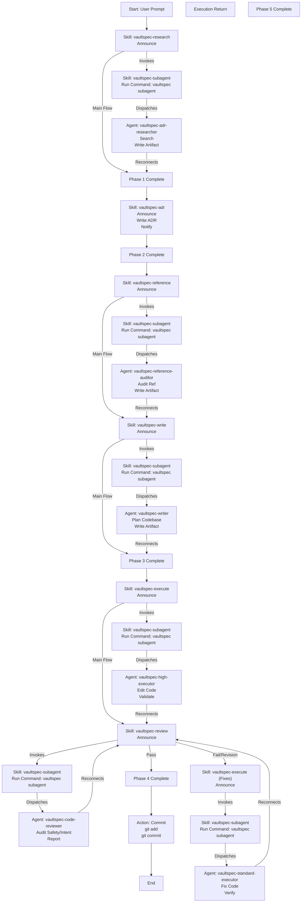

# Spec-Driven Development (SDD)

vaultspec is a language-agnostic development framework. Rules, skills, and
templates work with any language and toolchain. Agent personas reference the
project's established conventions rather than prescribing specific tools.

This folder contains the rule and template collection mandating the research,
reference, ADR, and agent-based development process.
The rules are compatible with Google Antigravity, Gemini CLI and Claude Code.

## User Manual

### The Workflow

The system enforces a strict **Research -> Specify -> Plan -> Execute ->
Verify** cycle. You do not simply "write code"; you build a trail of
documentation that ensures quality and context preservation.

**High-Level Summary:**

- **Research (`vaultspec-research`)** & **Reference (`vaultspec-reference`)**
  gather the data.
- **Specify (`vaultspec-adr`)** formalizes the choice.
- **Plan (`vaultspec-write`)** defines the steps.
- **Execute (`vaultspec-execute`)** builds it.
- **Verify (`vaultspec-review`)** validates it.
- **Curate (`vaultspec-curate`)** cleans up.

#### Detailed Steps

- **Research (`vaultspec-research`)**:
  - **Goal:** Understand the problem, explore libraries, and find "frontier"
    patterns.
  - **Agent:** `vaultspec-adr-researcher` (High Tier).
  - **Output:** `.vault/research/...` artifact.
  - *Usage:* "Activate `vaultspec-research` to investigate `{topic}`."

- **Specify (`vaultspec-adr`)**:
  - **Goal:** Make binding technical decisions based on your research.
  - **Output:** `.vault/adr/...` artifact.
  - *Usage:* "Activate `vaultspec-adr` to formalize our decision on
    `{topic}`."

- **Plan (`vaultspec-write`)**:
  - **Goal:** Convert the ADR into a step-by-step implementation plan.
  - **Agent:** `vaultspec-writer` (High Tier).
  - **Output:** `.vault/plan/...` artifact.
  - *Usage:* "Activate `vaultspec-write` to create a plan for `{feature}`."

- **Execute (`vaultspec-execute`)**:
  - **Goal:** Implement the plan using specialized sub-agents.
  - **Agent:** Orchestrator (You) + Executors (`vaultspec-low-executor`,
    `vaultspec-high-executor`).
  - **Output:** Code changes + `.vault/exec/...` logs.
  - *Usage:* "Activate `vaultspec-execute` to implement the plan."

- **Verify (`vaultspec-review`)**:
  - **Goal:** Validate the implementation against the plan and safety
    standards.
  - **Agent:** `vaultspec-code-reviewer` (High Tier).
  - *Usage:* "Activate `vaultspec-review` to audit the implementation."

- **Curate (`vaultspec-curate`)**:
  - **Goal:** Maintain the hygiene of the `.vault/` vault.
  - **Agent:** `vaultspec-docs-curator` (Medium Tier).
  - *Usage:* "Activate `vaultspec-curate` to audit the vault."

### Agent Reference

| Agent | Tier | Role | When to use |
| :--- | :--- | :--- | :--- |
| `vaultspec-adr-researcher` | HIGH | Researcher | New tech, architecture |
| `vaultspec-writer` | HIGH | Planner | After ADR approval |
| `vaultspec-docs-curator` | MED | Librarian | Links, tags, schema |
| `vaultspec-reference-auditor` | MED | Auditor | Codebase patterns |
| `vaultspec-high-executor` | HIGH | Sr. Engineer | Refactors, new logic |
| `vaultspec-standard-executor` | MED | Engineer | Feature work |
| `vaultspec-low-executor` | LOW | Jr. Engineer | Rote tasks, fixes |
| `vaultspec-code-reviewer` | HIGH | Reviewer | Safety, quality |

## Context Management

The system context is managed through config sync and system prompt assembly
in `.vaultspec/`:

- **`system/framework.md` (Bootstrap Prompt):** The XML-structured bootstrap
  prompt that cold-starts an LLM agent with operational knowledge of
  vaultspec — identity, pipeline phases, intent-to-skill mapping, dispatch
  references, and folder conventions. Lives in `system/` with
  `pipeline: config` frontmatter so it feeds into `config sync` output only
  (not `system sync`).
- **`system/project.md` (User-Editable):** A placeholder for
  project-specific instructions, extra context, or user preferences. This
  content is appended verbatim to the generated config files.
- **`vaultspec config sync`:** This command synchronizes `system/framework.md`
  and `system/project.md` into the root `AGENTS.md` and tool-specific files
  (`CLAUDE.md`, `GEMINI.md`).
- **`vaultspec system show`:** Displays the composable system prompt parts and
  their generation targets.
- **`vaultspec system sync`:** Assembles parts from `system/` into `SYSTEM.md`
  and syncs it to tool destinations (e.g., `.gemini/SYSTEM.md`).

**Syntactic Stability:**
Framework context is stored in the **YAML frontmatter** (under the
`system_framework` key) of the generated files to ensure it remains
syntactically stable and separated from user-provided content.

### File Responsibilities

| File | Purpose | Managed By |
| :--- | :--- | :--- |
| `system/framework.md` | Bootstrap prompt | `config sync` |
| `system/project.md` | Project context | User |
| `AGENTS.md` | Root AI entry point | `vaultspec` |
| `CLAUDE.md` | Claude Code config | `vaultspec` |
| `GEMINI.md` | Gemini CLI config | `vaultspec` |
| `system/` | Composable prompts | Developer |
| `SYSTEM.md` | Gemini system prompt | `vaultspec` |

## Overview Diagram

> **Note:** The `vaultspec-subagent` skill is a **utility task** used
> internally by other agents. It should **not** be called directly by the
> user.

## Markdown Files

Workflows, agents, skills, and templates are defined in their respective
subfolders without any tool specific yaml configuration headers or metadata.
Tools reference relatively the `.vaultspec` folder and define their own
tool-specific yaml configuration headers.

## Example Workflow

A possible workflow might look something like this, disregarding loopbacks
and decision reversals:

