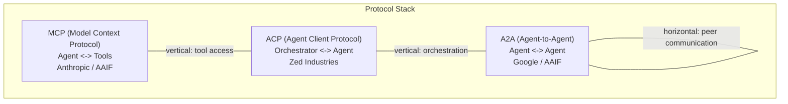
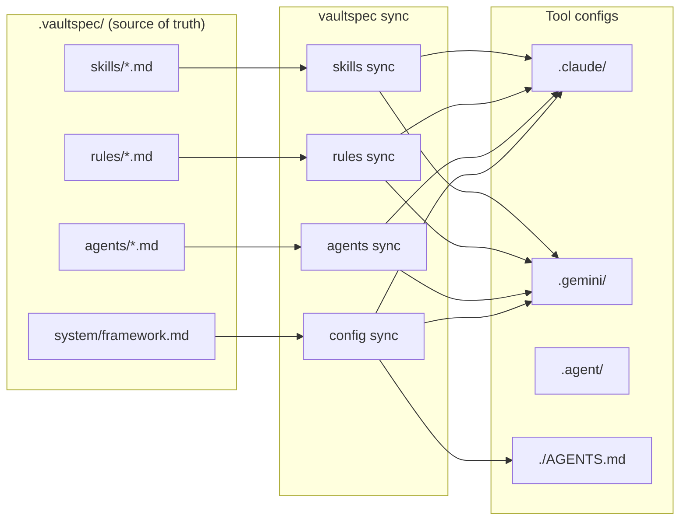
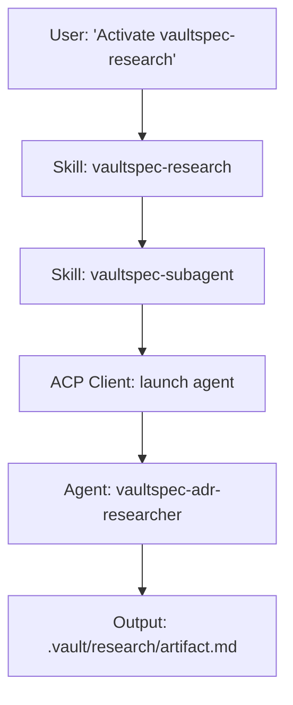

# Concepts & Tutorial

This document covers two things: a worked tutorial showing the full vaultspec
pipeline end to end, followed by a reference explanation of the core concepts
behind it.

---

## Your First Governed Feature

This tutorial walks you through the full vaultspec pipeline using a concrete
example: adding a `/health` endpoint to a web service. By the end, you will
have created a complete audit trail in `.vault/` — research findings, an
architectural decision record, a plan, execution records, and a code review.

The five phases map to five skills:

| Phase    | Skill              | Artifact                      |
|----------|--------------------|-------------------------------|
| Research | vaultspec-research | `.vault/research/...`         |
| Specify  | vaultspec-adr      | `.vault/adr/...`              |
| Plan     | vaultspec-write    | `.vault/plan/...`             |
| Execute  | vaultspec-execute  | `.vault/exec/.../steps`       |
| Verify   | vaultspec-review   | `.vault/exec/.../review`      |

### Setup

Clone the repository and install dependencies:

```bash
git clone https://github.com/wgergely/vaultspec
cd vaultspec
uv sync --extra dev
```

Verify the CLI is available:

```bash
vaultspec --help
```

The `.vault/` directory is created automatically the first time you invoke a
skill. It holds all your project's documented decisions and execution records.

### Research

Before writing any code, you gather evidence. The `vaultspec-research` skill
dispatches a research sub-agent that searches the codebase, queries
documentation, and synthesizes findings into a structured artifact.

**Invoke the skill:**

```text
/vaultspec-research
```

The agent will ask for a topic. Provide:

> Research best practices for implementing a `/health` HTTP endpoint in a
> Python ASGI web service. Consider response format, status codes, dependency
> checking, and observability.

The sub-agent produces a file at:

```text
.vault/research/2026-02-18-health-endpoint-research.md
```

**Sample output:**

```markdown
---
tags:
  - "#research"
  - "#health-endpoint"
date: "2026-02-18"
related:
  - "[[2026-02-18-health-endpoint-adr]]"
---

# `health-endpoint` research: HTTP health check patterns

## Findings

### Response format

The two dominant conventions are plain-text `OK` and structured JSON.
JSON is preferred when the endpoint needs to report sub-system status.
The IETF Health Check Response Format defines `application/health+json`
with fields `status`, `checks`, and `version`.

### Status codes

- `200 OK` — service is healthy and ready
- `503 Service Unavailable` — running but not ready

### Implementation options

| Option    | Pros                      | Cons                      |
|-----------|---------------------------|---------------------------|
| Starlette | Already a dependency      | Manual JSON serialisation |
| FastAPI   | Auto-schema, OpenAPI docs | Not yet in project deps   |
| Plain ASGI| Zero overhead             | Boilerplate-heavy         |

**Recommendation:** Use Starlette (already in `pyproject.toml`) with a
shallow JSON liveness check.
```

**Verify:** The file exists and contains a `## Findings` section with populated
content.

### Specify

With research in hand, you formalise the decision in an Architecture Decision
Record. The `vaultspec-adr` skill reads the research artifact and produces a
structured decision document.

**Invoke the skill:**

```text
/vaultspec-adr
```

Reference the research artifact when prompted:

> Based on [[2026-02-18-health-endpoint-research]], create an ADR for
> implementing a `/health` endpoint using Starlette with a shallow JSON response.

The agent produces:

```text
.vault/adr/2026-02-18-health-endpoint-adr.md
```

**Sample output:**

```markdown
---
tags:
  - "#adr"
  - "#health-endpoint"
date: "2026-02-18"
related:
  - "[[2026-02-18-health-endpoint-research]]"
---

# `health-endpoint` adr: Starlette JSON health check | (**status:** `accepted`)

## Problem Statement

The service has no liveness probe. Kubernetes needs a reliable signal.

## Constraints

- Must not introduce new runtime dependencies
- Must return `200` when healthy, `503` when not ready
- Response schema: `{"status": "ok", "version": "<semver>"}`

## Rationale

Starlette is already present, so no new dependency is needed. A shallow
check is sufficient for a liveness probe.

## Consequences

- Kubernetes liveness probe can be configured to `GET /health`
- A future `/ready` endpoint will handle dependency checks
```

> **Important:** The ADR represents a decision. Edit it before proceeding if
> you disagree with the agent's recommendation.

### Plan

With an accepted ADR, you produce an execution plan. The `vaultspec-write`
skill reads the ADR and breaks the work into concrete, assignable steps.

**Invoke the skill:**

```text
/vaultspec-write
```

Reference the ADR:

> Write an implementation plan for [[2026-02-18-health-endpoint-adr]].

The agent produces:

```text
.vault/plan/2026-02-18-health-endpoint-phase1-plan.md
```

**Sample output:**

```markdown
## Tasks

- Task 1: Implement `health_handler` in `src/server/routes.py`
- Task 2: Register `/health` route in the app factory
- Task 3: Write unit test `tests/test_health.py`
- Task 4: Write integration test `tests/test_health_integration.py`
```

> **Approval gate:** Review the plan and confirm before continuing. Once you
> approve, execution begins.

### Execute

With an approved plan, you dispatch implementation sub-agents.

**Invoke the skill:**

```text
/vaultspec-execute
```

Reference the plan:

> Execute [[2026-02-18-health-endpoint-phase1-plan]].

Each task produces a step record:

```text
.vault/exec/2026-02-18-health-endpoint/
  2026-02-18-health-endpoint-phase1-step1-exec.md
  2026-02-18-health-endpoint-phase1-step2-exec.md
  2026-02-18-health-endpoint-phase1-step3-exec.md
  2026-02-18-health-endpoint-phase1-step4-exec.md
  2026-02-18-health-endpoint-phase1-summary.md
```

**Sample step record:**

```markdown
# `health-endpoint` `phase1` `step1`

Implemented `health_handler` in `src/server/routes.py`.

## Description

Added an async handler that reads the package version via
`importlib.metadata.version("vaultspec")` and returns a `JSONResponse`
with `{"status": "ok", "version": version}`.
```

### Verify

After execution, `vaultspec-review` performs a holistic audit.

**Invoke the skill:**

```text
/vaultspec-review
```

The reviewer checks feature completeness, ADR compliance, safety, and test
coverage. It produces:

```text
.vault/exec/2026-02-18-health-endpoint/2026-02-18-health-endpoint-review.md
```

A clean review outputs **PASS**. If issues are found, the reviewer issues
**REVISION REQUIRED** with specific findings to fix before re-reviewing.

### What You've Built

```text
.vault/
  research/
    2026-02-18-health-endpoint-research.md   # evidence gathered
  adr/
    2026-02-18-health-endpoint-adr.md        # decision recorded
  plan/
    2026-02-18-health-endpoint-phase1-plan.md  # work scoped
  exec/
    2026-02-18-health-endpoint/
      2026-02-18-health-endpoint-phase1-step1-exec.md
      2026-02-18-health-endpoint-phase1-step2-exec.md
      2026-02-18-health-endpoint-phase1-step3-exec.md
      2026-02-18-health-endpoint-phase1-step4-exec.md
      2026-02-18-health-endpoint-phase1-summary.md
      2026-02-18-health-endpoint-review.md   # audit trail closed
```

Every decision is traceable. Six months from now, a new contributor can open
the ADR and understand exactly why the endpoint was built the way it was.

---

## Core Concepts

### What is Spec-Driven Development?

Spec-Driven Development (SDD) is a methodology where every code change flows
through a structured pipeline:

- **Research** the problem space
- **Specify** the decision in an Architecture Decision Record
- **Plan** the implementation steps
- **Execute** the plan with specialized agents
- **Verify** the output against the plan

The key insight: AI agents are fast but forgetful. They lose context between
sessions, skip steps under pressure, and produce inconsistent output. SDD adds
governance by requiring artifacts at each stage, creating a traceable chain
from "why are we doing this?" to "here is the working code."

### What Does "Governed" Mean?

Governance in vaultspec comes from three mechanisms:

- **Rules** constrain what agents can and cannot do. They are synced to
  tool-specific config files (`.claude/`, `.gemini/`) so constraints are
  enforced by the AI tool itself.
- **Skills** define user-invocable workflows. When you say "activate
  `vaultspec-research`", the skill maps that intent to the right agent,
  provides instructions, and ensures the output artifact is created.
- **Templates** ensure consistency. Every document in `.vault/` follows a
  template with mandatory YAML frontmatter (tags, date, related links),
  preventing drift in documentation structure.

### The .vault/ Knowledge Base

The `.vault/` directory is the persistent memory of the project:

| Directory        | Content                                    | Tag         |
| ---------------- | ------------------------------------------ | ----------- |
| `.vault/adr/`    | Architecture Decision Records              | `#adr`      |
| `.vault/audit/`  | Audit reports and assessments              | `#audit`    |
| `.vault/exec/`   | Execution records (steps and summaries)    | `#exec`     |
| `.vault/plan/`   | Implementation plans                       | `#plan`     |
| `.vault/reference/` | Reference audits and blueprints         | `#reference`|
| `.vault/research/`  | Research and brainstorming              | `#research` |

**Why it matters:**

- **Context preservation** — AI agents search the vault to recover context from
  previous sessions
- **Traceability** — every code change traces back through exec → plan → ADR →
  research
- **Searchability** — the RAG pipeline indexes all documents for semantic search

### Naming Conventions

All documents follow the pattern: `YYYY-MM-DD-<feature>-<type>.md`

Examples:

- `2026-02-07-rag-search-research.md`
- `2026-02-08-rag-search-adr.md`
- `2026-02-09-rag-search-plan.md`

Execution records nest under a feature directory:
`.vault/exec/YYYY-MM-DD-<feature>/YYYY-MM-DD-<feature>-<phase>-<step>.md`

### Tag Taxonomy

Every document has exactly two tags:

1. **Directory tag** — matches the subdirectory (`#adr`, `#research`, etc.)
2. **Feature tag** — groups related documents (`#rag`, `#protocol`)

### Hooks

Hooks let you automate post-phase actions without modifying the core pipeline.
They are YAML files in `.vaultspec/rules/hooks/` that attach shell commands or
agent dispatches to lifecycle events such as `vault.document.created`,
`vault.index.updated`, `config.synced`, and `audit.completed`. A hook fires
automatically after its lifecycle event completes — for example, you can trigger
a curate agent every time a new vault document is created, or run a linter after
`sync-all`. Hook failures are always logged at debug level and never block the
parent command. See [hooks-guide.md](hooks-guide.md) for the full schema,
event list, and examples.

### Agents, Skills, and Rules

**Agents** are AI personas with defined roles and capability tiers:

| Tier   | Model Class    | Examples                      |
| ------ | -------------- | ----------------------------- |
| HIGH   | Most capable   | Researcher, planner, reviewer |
| MEDIUM | Balanced       | Standard executor, curator    |
| LOW    | Fastest        | Simple executor (rote tasks)  |

**Skills** are user-invocable workflows: `vaultspec-research`,
`vaultspec-adr`, `vaultspec-write`, `vaultspec-execute`, `vaultspec-review`,
`vaultspec-curate`.

**Rules** are behavioral constraints synced to `.claude/rules/`,
`.gemini/rules/`, etc. by `vaultspec rules sync`.

### The Protocol Stack



- **MCP**: agent → tools (stdio transport). The `vaultspec-mcp` server
  exposes `list_agents`, `dispatch_agent`, `get_task_status`, `cancel_task`,
  `get_locks`.
- **ACP**: orchestrator → agent (stdio). Handles session lifecycle for
  sub-agent dispatch.
- **A2A**: agent ↔ agent (HTTP/JSON-RPC). Enables cross-model agent
  coordination (e.g., Claude delegating to Gemini).

### Architecture Diagrams

**Config Sync Flow:**



**Agent Dispatch Flow:**


