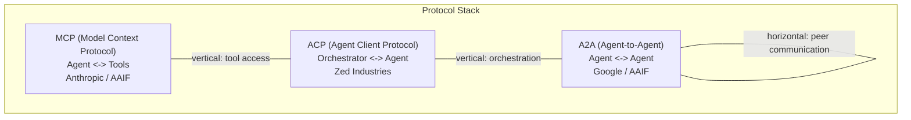
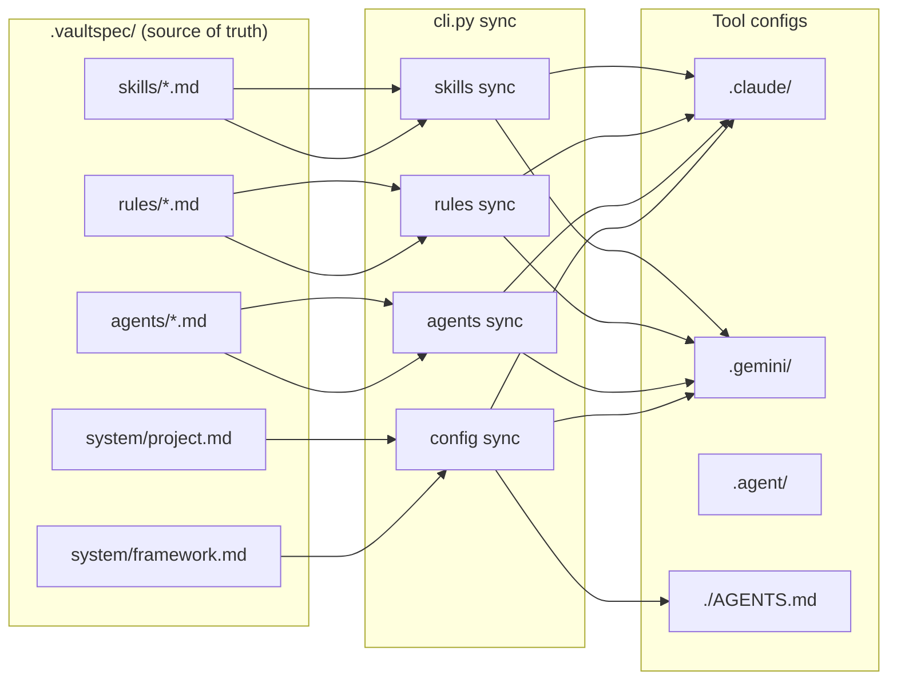
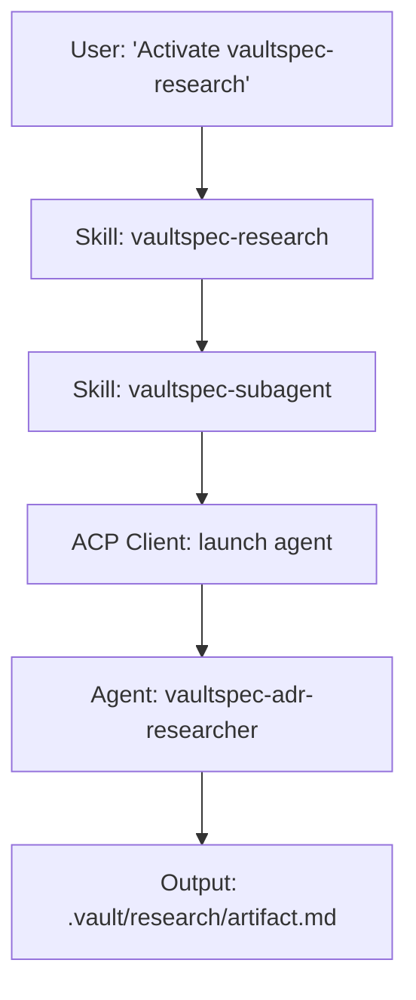

# Concepts

This document explains the core ideas behind vaultspec: the
methodology, the agent system, and the protocol stack.

## What is Spec-Driven Development?

Spec-Driven Development (SDD) is a methodology where every code
change flows through a structured pipeline:

1. **Research** the problem space
2. **Specify** the decision in an Architecture Decision Record
3. **Plan** the implementation steps
4. **Execute** the plan with specialized agents
5. **Verify** the output against the plan

The key insight: AI agents are fast but forgetful. They lose
context between sessions, skip steps under pressure, and produce
inconsistent output. SDD adds governance by requiring artifacts at
each stage, creating a traceable chain from "why are we doing
this?" to "here is the working code."

## What Does "Governed" Mean?

Governance in vaultspec comes from three mechanisms:

- **Rules** constrain what agents can and cannot do. They are
  synced to tool-specific config files (`.claude/`, `.gemini/`)
  so constraints are enforced by the AI tool itself.
- **Skills** define user-invocable workflows. When you say
  "activate `vaultspec-research`", the skill maps that intent to
  the right agent, provides instructions, and ensures the output
  artifact is created.
- **Templates** ensure consistency. Every document in `.vault/`
  follows a template with mandatory YAML frontmatter (tags, date,
  related links), preventing drift in documentation structure.

## The 5-Phase Workflow

### Phase 1: Research (`vaultspec-research`)

**Agent**: `vaultspec-adr-researcher` (HIGH tier)

Explores the problem space. The researcher searches documentation,
evaluates packages, analyzes patterns in open-source projects, and
produces a research artifact in `.vault/research/`.

### Phase 2: Specify (`vaultspec-adr`)

**Agent**: Orchestrator (the main AI session)

Formalizes decisions based on research. The output is an
Architecture Decision Record (ADR) in `.vault/adr/` that documents
the chosen approach, alternatives considered, and rationale.

### Phase 3: Plan (`vaultspec-write`)

**Agent**: `vaultspec-writer` (HIGH tier)

Converts the ADR into actionable steps. The planner reads the
codebase, cross-references the ADR and research, and produces a
phased implementation plan in `.vault/plan/`.

### Phase 4: Execute (`vaultspec-execute`)

**Agents**: `vaultspec-complex-executor` (HIGH),
`vaultspec-standard-executor` (MEDIUM),
`vaultspec-simple-executor` (LOW)

Implements the plan. The orchestrator dispatches work to executor
agents based on task complexity. Each step produces an execution
record in `.vault/exec/`.

### Phase 5: Verify (`vaultspec-review`)

**Agent**: `vaultspec-code-reviewer` (HIGH tier)

Audits the implementation against the plan. Checks for safety
violations, intent compliance, and code quality. If issues are
found, the reviewer sends the work back to execution.

## The .vault/ Knowledge Base

The `.vault/` directory is the persistent memory of the project.
It stores:

| Directory | Content | Tag |
| --------- | ------- | --- |
| `.vault/adr/` | Architecture Decision Records | `#adr` |
| `.vault/audit/` | Audit reports and assessments | `#audit` |
| `.vault/exec/` | Execution records (steps and summaries) | `#exec` |
| `.vault/plan/` | Implementation plans | `#plan` |
| `.vault/reference/` | Reference audits and blueprints | `#reference` |
| `.vault/research/` | Research and brainstorming | `#research` |

### Why It Matters

- **Context preservation** -- when an AI agent starts a new
  session, it can search the vault to recover context from
  previous work
- **Traceability** -- every code change can be traced back
  through exec -> plan -> ADR -> research
- **Searchability** -- the RAG pipeline indexes all documents
  for semantic search with filter tokens

### Naming Conventions

All documents follow the pattern: `YYYY-MM-DD-<feature>-<type>.md`

Examples:

- `2026-02-07-rag-search-research.md`
- `2026-02-08-rag-search-adr.md`
- `2026-02-09-rag-search-plan.md`

Execution records are nested:
`.vault/exec/YYYY-MM-DD-<feature>/YYYY-MM-DD-<feature>-<phase>-<step>.md`

### Tag Taxonomy

Every document has exactly two tags in its YAML frontmatter:

1. **Directory tag** -- matches the subdirectory (`#adr`,
   `#audit`, `#exec`, `#plan`, `#reference`, `#research`)
2. **Feature tag** -- groups related documents (`#rag`,
   `#protocol`, `#editor-demo`)

## Agents, Skills, and Rules

### Agents

Agents are AI personas with defined roles and capability tiers:

| Tier   | Model Class    | Examples                        |
| ------ | -------------- | ------------------------------- |
| HIGH   | Most capable   | Researcher, planner, reviewer   |
| MEDIUM | Balanced       | Standard executor, curator      |
| LOW    | Fastest        | Simple executor (rote tasks)    |

Agent definitions live in `.vaultspec/agents/` as markdown files
with YAML frontmatter specifying tier, mode, and tools.

### Skills

Skills are user-invocable workflows that map intents to agent
dispatches:

- `vaultspec-research` -- "investigate [topic]" -> dispatches
  researcher agent
- `vaultspec-adr` -- "formalize decision on [topic]" -> writes ADR
- `vaultspec-write` -- "create plan for [feature]" -> dispatches
  planner agent
- `vaultspec-execute` -- "implement the plan" -> dispatches executor agents
- `vaultspec-review` -- "audit the implementation" -> dispatches reviewer agent
- `vaultspec-curate` -- "audit the vault" -> dispatches docs curator

Skills live in `.vaultspec/skills/` as markdown files.

### Rules

Rules are behavioral constraints synced to tool-specific config
files. They enforce patterns like:

- Always create documentation artifacts before writing code
- Always use wiki-links for cross-references
- Always include proper frontmatter tags

Rules live in `.vaultspec/rules/` and are synced to
`.claude/rules/`, `.gemini/rules/`, etc. by
`cli.py rules sync`.

## The Protocol Stack

vaultspec uses three protocols that serve different communication
needs:

### MCP (Model Context Protocol)

**Direction**: Vertical (agent -> tools)
**Transport**: stdio
**Purpose**: Gives agents access to tools (file operations,
search, vault management)

The vaultspec MCP server (`vs-subagent-mcp`) exposes 5 tools:
`list_agents`, `dispatch_agent`, `get_task_status`,
`cancel_task`, `get_locks`.

### ACP (Agent Client Protocol)

**Direction**: Vertical (orchestrator -> agent)
**Transport**: stdio
**Purpose**: The orchestrator launches and manages sub-agent sessions

When a skill dispatches an agent (e.g., `vaultspec-research`
dispatches `vaultspec-adr-researcher`), ACP handles the session
lifecycle: initialization, message passing, and shutdown.

### A2A (Agent-to-Agent Protocol)

**Direction**: Horizontal (agent <-> agent)
**Transport**: HTTP (JSON-RPC)
**Purpose**: Peer-to-peer communication between agents

A2A enables scenarios like a Claude agent delegating work to a
Gemini agent, with structured task states (submitted, working,
completed, failed) and agent discovery via Agent Cards.

## Architecture Diagrams

### Config Sync Flow

### Agent Dispatch Flow

